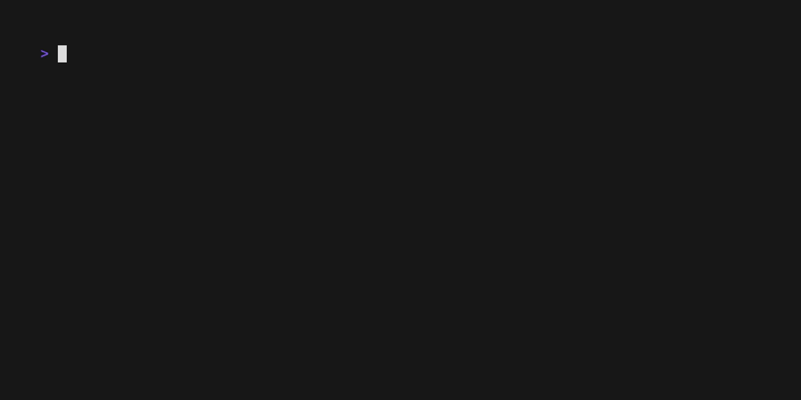

# 🦀 try-rs 🦀
> **A blazing fast, Rust-based workspace manager for your temporary experiments.**


**try-rs** is a CLI tool designed to manage the chaos of temporary projects. Instead of cluttering your Desktop or `/tmp` with `test1`, `new-test`, and `final-test`, `try-rs` organizes them into date-prefixed directories, offering a robust TUI (Terminal User Interface) to create, navigate, and clean up your experiments.



## 💡 Inspiration

This project is a Rust port and re-imagination of the excellent [try](https://github.com/tobi/try) tool by **Tobi Lütke**.

While the original is a lightweight Ruby script, **try-rs** aims to bring the same philosophy, "Your experiments deserve a home", but with the performance, type safety, and modern TUI capabilities (using [Ratatui](https://github.com/ratatui/ratatui)) of the Rust ecosystem.

## ✨ Features

| Feature | Description |
| :--- | :--- |
| **🏎️ Blazing Fast** | Built in Rust, compiled to native binary. No interpreter lag. |
| **🖼️ Rich TUI** | Beautiful terminal interface built with Ratatui. |
| **🔍 Fuzzy Search** | Instantly find old experiments with smart matching. |
| **📅 Auto-Dating** | Creates directories like `2025-12-17-rust-test` automatically. |
| **🐙 Git Integration** | Auto-clones URLs (`try-rs <url>`) and marks repos with (). |
| **👀 Content Preview** | Inspect files inside a folder before entering it. |
| **📝 Editor Integration** | Open experiments directly in your editor (`Ctrl+E`). |
| **🎨 Theming** | Customizable UI colors (Catppuccin Mocha default). |
| **🗑️ Safe Deletion** | Delete old experiments via UI with confirmation (`Ctrl+D`). |
| **⚙️ Configurable** | Supports XDG Base Directory (`~/.config/try-rs/config.toml`). |

## 📦 Installation

### Prerequisites

* Rust & Cargo installed.
* A shell (Fish, Zsh, Bash).
* A **Nerd Font** installed (required for icons like  and 🦀).

### Building from source

```bash
git clone [https://github.com/tassiovirginio/try-rs.git](https://github.com/tassiovirginio/try-rs)
cd try-rs
cargo install --path . --bin try-rs
```

### Cargo install try-rs
```bash
cargo install try-rs
```

### Install in Archlinux
```bash
yay -S try-rs-bin
```

⚙️ Configuration

1. Setup the Shell Integration

Since try-rs needs to change your shell's current directory, it requires a small wrapper function.

🐟 Fish Shell (Recommended)

```bash
try-rs --setup fish
```

(Optional) Create an abbreviation:

```
abbr --add try try-rs
```

🐚 Zsh

```bash
try-rs --setup zsh
```

🐚 Bash

```bash
try-rs --setup bash
```


2. Config File
By default, experiments are stored in `~/work/tries`. You can customize the path and the UI colors (themes). To change this, create `~/.config/try-rs/config.toml`:

```toml
# ~/.config/try-rs/config.toml
tries_path = "~/Development/playground"
editor = "code" # Optional: code, nvim, hx, etc.

[colors]
title_try = "Magenta"
title_rs = "White"
search_box = "Green"
list_date = "Blue"
list_highlight_bg = "Magenta"
list_highlight_fg = "Black"
help_text = "DarkGray"
status_message = "Yellow"
popup_bg = "DarkGray"
popup_text = "LightRed"
```


🚀 Usage

Simply type try-rs (or your alias) in your terminal.

### Key Bindings

| Key      | Action                                               |
|----------|------------------------------------------------------|
| `Type`   | Filter the list (Fuzzy Search)                       |
| `↑` / `↓`| Navigate the list                                    |
| `Enter`  | Select directory (or create new if text doesn't match) |
| `Ctrl+D` | Delete the selected directory (triggers popup)       |
| `Ctrl+E` | Open in editor (configured in config.toml)           |
| `Esc`    | Cancel / Close Popup                                 |

### CLI Commands

You can also bypass the UI:

| Command                                      | Description                                  |
|----------------------------------------------|----------------------------------------------|
| `try-rs`                                     | Opens the TUI                                |
| `try-rs <name>`                              | Create (or jump to) a named experiment       |
| `try-rs <https://github.com/user/repo>` | Clones a repository into a dated folder      |
| `try-rs --setup <shell>` | setup shell integration (fish, zsh, bash)    |
| `try-rs --version`                           | Show application version                     |
| `try-rs --help`                              | Show help message                            |

🤝 Contributing
Pull requests are welcome! For major changes, please open an issue first to discuss what you would like to change.

📄 License
[MIT](LICENSE)
